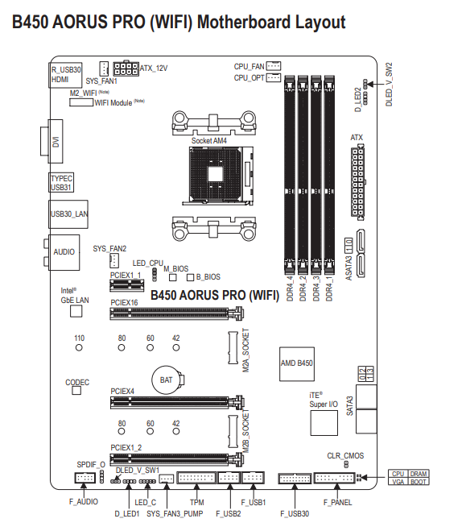
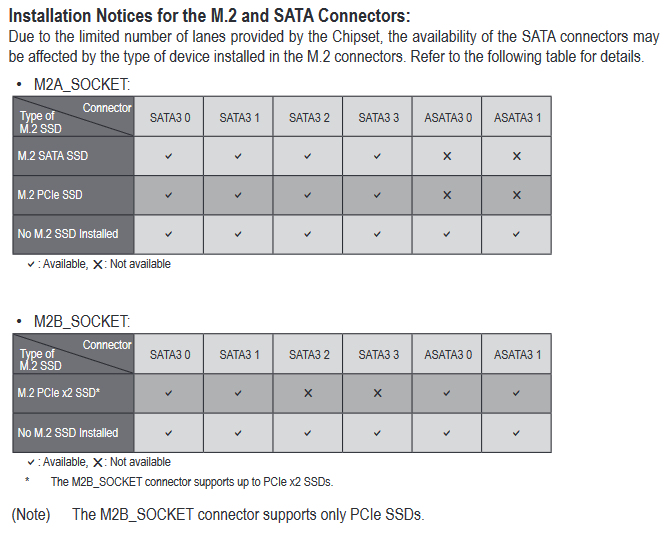

# #Windows
> Windows 10 ---> SSD Nvme

### Backups
- [x] Documents folder
- [x] Downloads folder

### Drivers
- [x] Nvdia [GTX 970](https://www.nvidia.com.br/Download/index.aspx?lang=br)
- [x] Keyboard Corsair & [iCue](https://www.corsair.com/br/pt/icue)
- [x] Mouse [Logitech G600](https://support.logi.com/hc/pt-br/articles/360025298053)

### Softwares
- [x] [Google chrome](https://www.google.pt/intl/pt-PT/chrome/)
- [x] [Steam](https://store.steampowered.com/)
- [x] [Origin](https://www.origin.com/bra/pt-br/store/download)
- [x] [Epic Games](https://www.epicgames.com/store/pt-BR/)
- [x] [Ubisoft](https://ubisoftconnect.com/pt-BR/)
- [x] [Discord](https://discord.com/download)
- [x] [Whatsapp](https://www.whatsapp.com/download)
- [x] [Nvidia Geforce Experience](https://www.nvidia.com/pt-br/geforce/geforce-experience/)

### Configs
- [x] Windows update
- [x] Verify windows auto startup entries
- [x] Execute Windows Update cleaning tool


# #Linux
> Ubuntu 21.10 ---> SSD Satas

## 1. Pre formatting

### Backups
- [x] Laravel projects: databases (docker)
- [x] Laravel projects: `.env` files
- [x] SSH keys & configs `~/.ssh/`
- [x] Credentials aws/azure
- [x] Opened chrome tabs

## 2. Pos formatting

### Drivers
- [x] Nvidia GTX 970 (via app updater)

### Softwares
- Prefer to download directly on vendor website:
	- [x] [Google Chrome](https://www.google.pt/intl/pt-PT/chrome/)
	- [x] [Ray](https://spatie.be/profile/purchases)
	- [x] [Discord](https://discord.com/download)
- Those can be installed via Ubuntu Software app:
	- [x] PhpStorm
	- [x] DataGrip
	- [x] VS Code
	- [x] Postman
	- [x] RDM redis ui
	- [x] Terminator `*`
	- [x] Spotify
	- [x] Steam
	- [x] Libre Office
	- [x] Gimp (snap)
	- [x] Menu Editor
	- [x] Gnome tweak tools
- CLI:
	- [x] Git `*`
	- [x] [Docker](https://docs.docker.com/engine/install/ubuntu/#install-using-the-convenience-script) & [Docker Compose](https://docs.docker.com/compose/install/) `*`
	- [x] [Ngrok](https://ngrok.com/download) `*`
	- [x] [ZSH](https://github.com/ohmyzsh/ohmyzsh/wiki/Installing-ZSH) & [OhMyZsh](https://github.com/ohmyzsh/ohmyzsh) `*`
	- [x] Node.js `*`
	- [x] PHP cli `*`
	- [x] [Composer](https://getcomposer.org/download/) `*`

### Configs
- [x] [Gnome extensions:](https://extensions.gnome.org/)
	- [x] [Sound Input & Output Device Chooser](https://extensions.gnome.org/extension/906/sound-output-device-chooser/)
	- [x] [Vitals System Monitor](https://extensions.gnome.org/extension/1460/vitals/)
	- [x] [Open Weather](https://extensions.gnome.org/extension/750/openweather/)
		```bash
		# https://github.com/corecoding/Vitals#installation
		sudo apt install gir1.2-gtop-2.0 lm-sensors
		```
- [x] SSH keys & configs (backup)
- [x] OhMyZsh plugins `*`


# #Notes
- **Bios Storage** mode: UEFI only
- **Mobo drivers**: [Aorus B450 Pro Wi-fi](https://www.gigabyte.com/br/Motherboard/B450-AORUS-PRO-WIFI-rev-1x/support#support-dl)
- **Installation order**: Windows ---> Linux
- **RAID 0**: I can't do Ubuntu recognize the raid array. In windows it works properly.
	- Reference video: <https://www.youtube.com/watch?v=IUNtbe9Az9o>;
	- [Prints with SSDs tests](./PRINTS_SSD_TESTS.md).
- **SATA3 ports limitations**:
	- Using `M2A` slot (top) disables `ASATA3-0` and `ASATA3-1` connectors;
	- Using `M2B` slot (bottom) disables `SATA3-2` and `SATA3-3` connectors.
	[](https://www.gigabyte.com/br/Motherboard/B450-AORUS-PRO-WIFI-rev-1x/support#support-manual)
	[](https://www.gigabyte.com/br/Motherboard/B450-AORUS-PRO-WIFI-rev-1x/support#support-manual)

`*` installed by [install script](../README.md)
